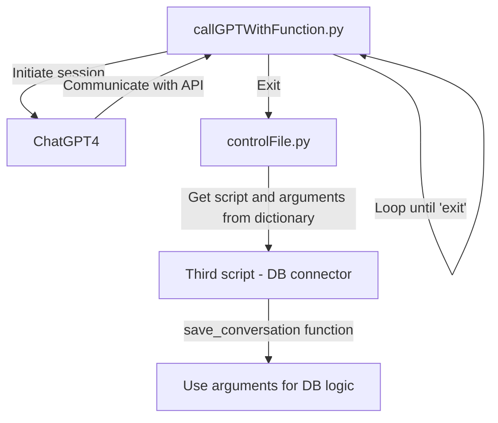

```mermaid
graph TD
    A[callGPTWithFunction.py] -->|Initiate session| B[ChatGPT4]
    B[ChatGPT4] -->|Communicate with API| A
    A -->|Loop until 'exit'| A
    A -->|Exit| C[controlFile.py]
    C -->|Get script and arguments from dictionary| D[Third script - DB connector]
    D -->|save_conversation function| E[Use arguments for DB logic]
```